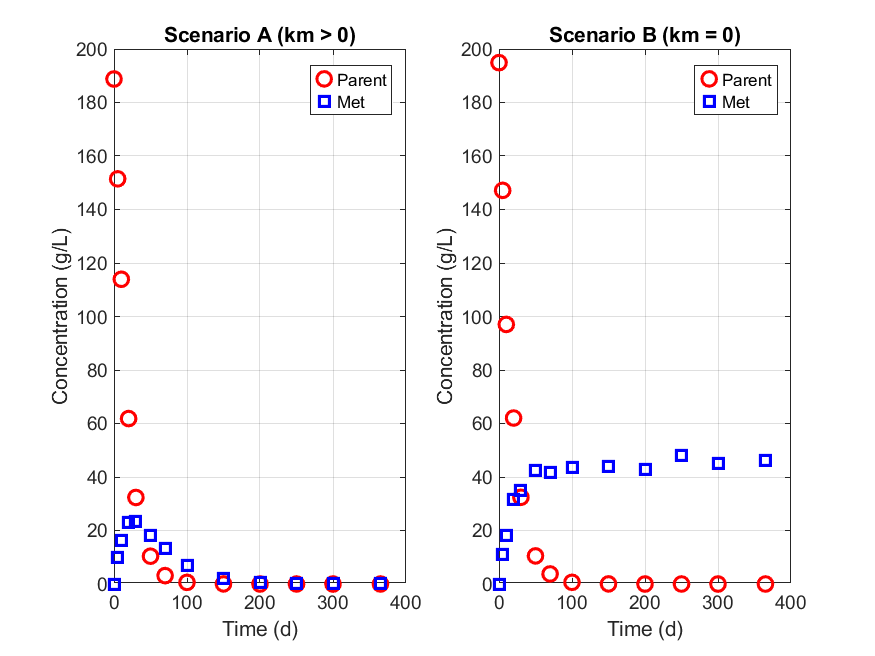
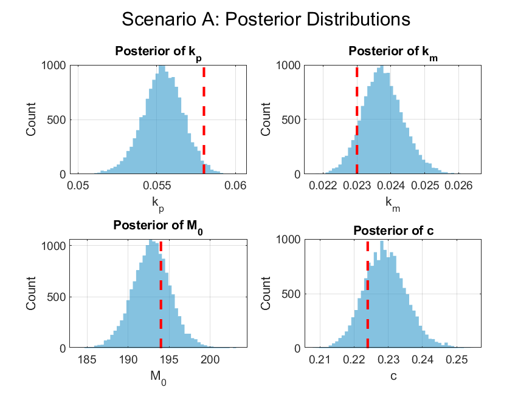
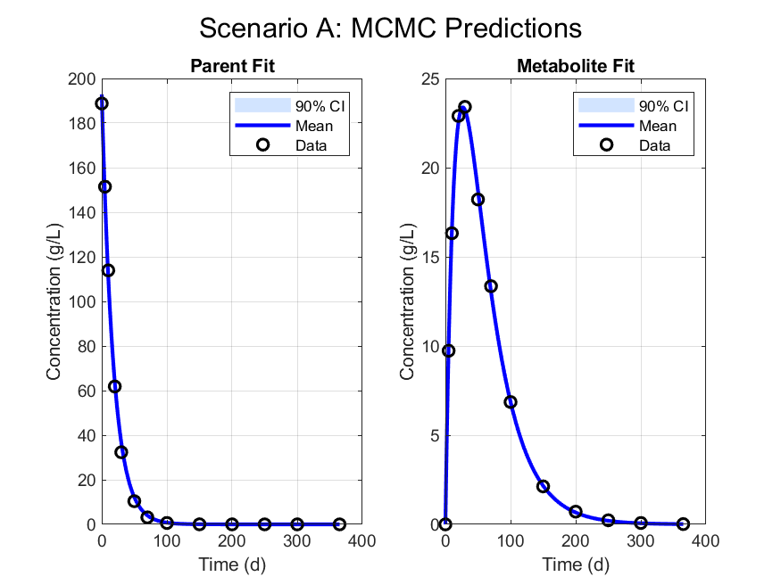
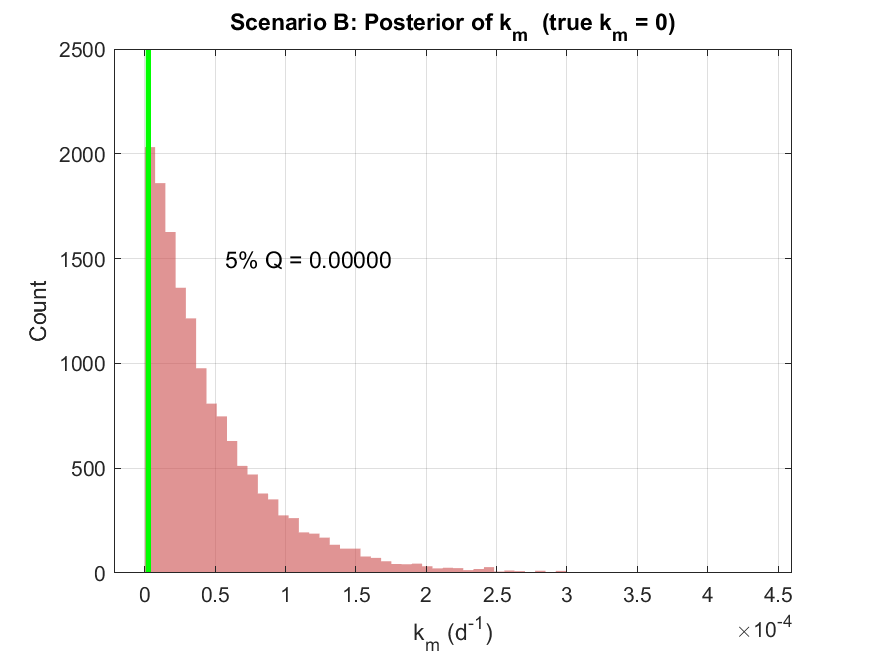
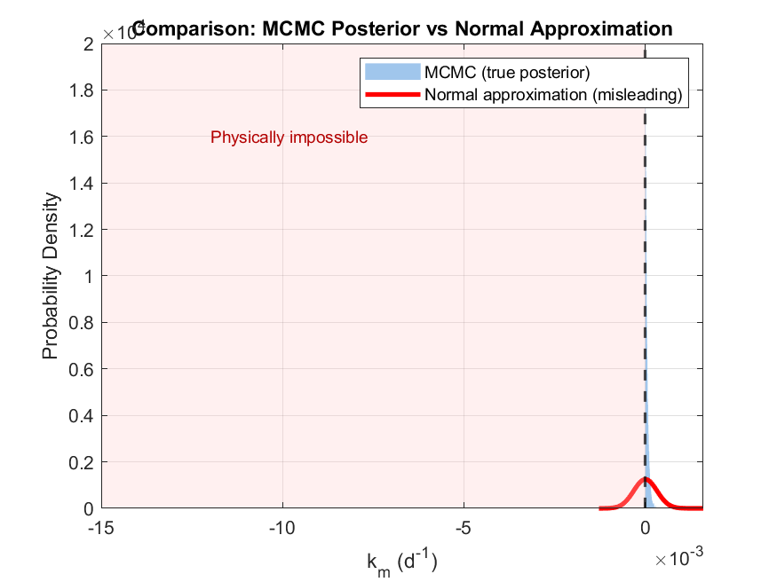

# 🧪 MCMC for Chemical Transformation Kinetics

> Bayesian parameter estimation for a Parent → Metabolite → Sink degradation model using Metropolis–Hastings MCMC — implemented in pure MATLAB with no additional toolboxes (except `fmincon` for the normal approximation comparison).

---

## 📌 Overview

This project implements a full Bayesian inference pipeline for chemical transformation kinetics, motivated by environmental fate modelling and pesticide risk assessment (FOCUS guidance). The core goal is to estimate the posterior distributions of degradation rate constants from noisy concentration–time data, and to demonstrate why the standard Normal (Laplace) approximation **fails** when parameters are constrained near a physical boundary.

Two scenarios are analysed:

| Scenario | Description | True k_m |
|----------|-------------|----------|
| **A** | Metabolite degrades (k_m > 0) | 0.023 d⁻¹ |
| **B** | Metabolite is persistent (k_m = 0) | 0.000 d⁻¹ |

---

## 🗂️ Repository Structure

```
📦 mcmc-chemical-kinetics/
├── main.m                        # Main script — runs everything end to end
├── model_func.m                  # Analytical ODE solution (Parent + Metabolite)
├── log_posterior.m               # Log-posterior evaluation with physical bounds
├── run_mcmc.m                    # Metropolis–Hastings sampler
├── figures/
│   ├── fig1_simulated_data.png
│   ├── fig2_posterior_A.png
│   ├── fig3_predictions_A.png
│   ├── fig4_posterior_B_km.png
│   └── fig5_comparison_mcmc_vs_normal.png
├── report/
│   └── MCMC_Chemical_Kinetics_Report.docx
└── README.md
```

---

## ⚙️ Model

The system is described by first-order coupled ODEs:

```
dP/dt = −kp · P(t)
dM/dt =  c · kp · P(t) − km · M(t)
```

**Analytical solution:**

```
P(t) = M0 · exp(−kp · t)

M(t) = c · M0 · kp · [exp(−km·t) − exp(−kp·t)] / (kp − km)   [kp ≠ km]
```

A L'Hôpital limiting form is applied automatically when `kp ≈ km`.

### Parameters

| Parameter | Symbol | Units | Physical Constraint |
|-----------|--------|-------|---------------------|
| Parent rate constant | k_p | d⁻¹ | > 0 |
| Metabolite rate constant | k_m | d⁻¹ | ≥ 0 |
| Initial parent mass | M₀ | g/L | > 0 |
| Molar conversion fraction | c | — | 0 ≤ c ≤ 1 |
| Parent noise (log scale) | log σ_p | — | unconstrained |
| Metabolite noise (log scale) | log σ_m | — | unconstrained |

---

## 🔢 MCMC Configuration

| Setting | Value |
|---------|-------|
| Total iterations | 200,000 |
| Burn-in | 50,000 |
| Thinning factor | 10 |
| Effective posterior samples | 15,000 per scenario |
| Proposal distribution | Isotropic Gaussian |
| Proposal SD — k_p | 0.0005 d⁻¹ |
| Proposal SD — k_m | 0.0002 d⁻¹ |
| Proposal SD — M₀ | 0.5 g/L |
| Proposal SD — c | 0.002 |
| Proposal SD — log σ | 0.015 |

---

## 📊 Key Results

### Acceptance Rates

| Scenario | Acceptance Rate | Notes |
|----------|----------------|-------|
| A (k_m > 0) | **42.9%** | Well-mixed; near-optimal for 6D random walk |
| B (k_m = 0) | **15.8%** | Lower due to boundary-adjacent posterior |

### 5th-Percentile of k_m Posterior

| Scenario | 5th Percentile | Interpretation |
|----------|---------------|----------------|
| A | 0.0228 d⁻¹ | Strong evidence of metabolite degradation |
| B | 2.55 × 10⁻⁶ d⁻¹ | Indistinguishable from zero → persistent metabolite |
| Normal approx. (B) | **−0.0005 d⁻¹** ❌ | Physically impossible — approximation fails |

### Why the Normal Approximation Fails

When the MAP estimate lies near a hard boundary (k_m ≥ 0), the symmetric Gaussian approximation assigns probability mass to physically impossible negative values. MCMC correctly respects the constraint, producing a right-skewed posterior that piles up at zero.

---

## 🖼️ Figures

| Figure | Description |
|--------|-------------|
|  | Simulated noisy observations for both scenarios |
|  | Posterior distributions — Scenario A |
|  | MCMC predictions with 90% CI — Scenario A |
|  | Posterior of k_m — Scenario B (true k_m = 0) |
|  | MCMC vs. Normal approximation |

---

## 🚀 Getting Started

### Requirements

- MATLAB R2019b or later
- Optimization Toolbox (`fmincon`) — required only for Figure 5 (normal approximation)
- No other toolboxes needed

### Running the Code

```matlab
% Clone the repo and open MATLAB in the project root
clc; clear; close all;

% Run the full pipeline
main
```

All five figures are saved automatically as `.png` files in the working directory.

### Reproducibility

A fixed random seed is set at the top of `main.m`:

```matlab
rng(42);
```

Results are fully reproducible across machines.

---

## 🧠 Methods Summary

### Log-Posterior

Under Gaussian measurement noise with unknown standard deviations σ_p and σ_m (sampled on the log scale), the log-posterior is:

```
log π(θ|y) = −½ Σ[(yp_i − P_i)²/σ_p²] − n·log(σ_p)
             −½ Σ[(ym_i − M_i)²/σ_m²] − n·log(σ_m)
```

Flat (improper) priors are applied within physical bounds; proposals outside bounds are assigned log-posterior = −∞.

### Metropolis–Hastings Acceptance

```
α = min(1,  π(θ* | y) / π(θᵗ | y))
```

### Normal Approximation (Laplace)

The MAP is located with `fmincon`; the posterior covariance is estimated by inverting the numerical Hessian (second-order finite differences) of the negative log-posterior.

---

## 📋 Data

Synthetic concentration–time data are generated internally at 13 time points:

```
t = [0, 5, 10, 20, 30, 50, 70, 100, 150, 200, 250, 300, 365]  (days)
```

5% relative Gaussian noise is added to both the Parent and Metabolite model predictions. No external data files are required.

---


